# Paper2ALE

Paper2ALE v0.3 turns a paper and its associated local artifacts into
paper-blind, self-contained, automatically verifiable ALE task families. It
is a provenance-first compiler, not a paper-reproduction agent: the paper is
used to construct tasks, while the evaluated agent receives only the task,
inputs, environment, and output contract.

The v0.3 path is end to end:

```mermaid
flowchart LR
    D["Optional paper discovery"] --> M["Operator manifest"]
    M --> R["Resolve and hash local sources/assets"]
    R --> T["Deterministic paper triage"]
    T --> X["Bounded map/reduce extraction"]
    X --> W["Workflow closure and candidate mining"]
    W --> G["Trusted generic protocol compiler"]
    G --> A["Golden, mutant, leakage, and reproducibility audit"]
    A --> P["Fail-closed publication"]
```



Discovery is optional and remains outside the trusted compiler. Paper2ALE does
not crawl the web or silently download code and data. Any discovery service
must hand off an explicit manifest containing local paths plus pinned public
metadata; the resolver then hashes the actual bytes.

## What v0.3 adds

- Local, content-addressed snapshots for PDFs, text, repositories, datasets,
  and individual files. The operator orchestration manifest still names local
  inputs and its output path; portable source and asset locks retain public
  locators, safe relative file names, and hashes rather than operator-local
  absolute paths.
- Deterministic paper and task suitability decisions: `eligible`,
  `manual_review`, `missing_artifacts`, `no_viable_task`, or `rejected`.
- Bounded map/reduce extraction with path-free source-extraction locks,
  source-bound findings, reduction-bound citations, workflow IR v2 origins,
  closure checks, and candidate mining.
- A trusted generic compiler for three bounded protocol templates, so every
  new paper does not require a new Python plugin.
- Fail-closed release mode: a plausible model response is only a proposal;
  publication still requires trusted compilation, a passing reference,
  rejected mutants, visibility checks, resource smoke checks, reproducibility,
  and archive validation.
- Difficulty v2 separates per-episode challenge, evaluator strength, and
  benchmark sampling. Publication-grade empirical calibration uses external
  trials bound to an exact verified task build and pinned agent system.

The implementation never imports, evaluates, or executes model-generated code.
Trusted executable behavior comes only from registered compiler capabilities.

## Quick start

Python 3.11 or newer is required.

```powershell
python -m pip install -e .

paper2ale inspect examples/generic/project.json
paper2ale audit examples/generic/project.json
paper2ale publish examples/generic/project.json --out dist --jobs 2
```

Run the complete paper-to-project path with an offline replay:

```powershell
paper2ale orchestrate examples/orchestration/manifest.json `
  --replay examples/orchestration/replay.json
```

Or use a local or hosted provider adapter:

```powershell
paper2ale orchestrate manifests/my-paper.json `
  --command python `
  --command-arg provider_adapter.py `
  --asset-cache .paper2ale/assets
```

No LLM API is mandatory. `ReplayProvider` is deterministic and offline;
`CommandProvider` can invoke a local model or an operator-owned hosted API
adapter. The provider is used only for structured extraction and proposal.
Compilation, evaluation, auditing, and packaging are deterministic.

The task-bearing `generate` CLI is intentionally fail-closed because a single
provider response cannot establish a trusted workflow/candidate binding. It
exits before provider completion and directs operators to `orchestrate`.
Library callers may use the lower-level one-shot API only when they supply
locally constructed trusted bindings; provider output cannot author them.

See [ORCHESTRATION.md](docs/ORCHESTRATION.md) for the manifest contract and
[GENERATION.md](docs/GENERATION.md) for provider and replay formats.
The runnable replay fixture is documented in
[examples/orchestration](examples/orchestration/README.md).

## Source admission policy

Paper2ALE does not equate “has public code” with “is a good task.” The default
policy is verification-first:

| Condition | Default result |
| --- | --- |
| Unreadable paper, incompatible license, or quality below the declared threshold | `rejected` |
| No reconstructable workflow, no independent verification route, or unbounded resources | `no_viable_task` |
| Required bytes are absent and no analytic/synthetic construction is available | `missing_artifacts` |
| Unknown license, incomplete provenance, weak evidence coverage, or unresolved source conflict | `manual_review` |
| No public code/data, but an independent analytic oracle or synthetic generator is possible | eligible with a warning |
| Closed, bounded, evidence-linked workflow with a trusted verification route | `eligible` |

The manifest’s paper profile is an operator attestation, not an automatic
peer-review score. Deterministic triage applies a pinned policy to those
signals. By default, orchestration admits only `eligible` papers and
candidates. Review-state overrides must be explicit, and release mode always
rejects unresolved synthesis findings.

Artifact availability is not accepted solely on attestation. A positive
`public_code` claim requires a resolved `repository` asset whose metadata says
`"visibility": "public"`; `public_data` similarly requires a public `dataset`
asset. Effective known-license signals are derived from concrete non-unknown
licenses on all corresponding public assets; an unsupported positive
availability/license assertion fails closed.
Scientific quality and evidence-coverage scores remain operator judgments and
are recorded as such.

## Generic trusted compiler

The `generic` family is a small allowlisted protocol virtual machine. It
currently supports:

| Template | Participant problem | Trusted evaluation |
| --- | --- | --- |
| `numeric-affine-v1` | infer an affine transform from examples and predict held-out queries | RMSE and maximum error with strict shape, finite-number, and query-ID gates |
| `table-filter-sort-v1` | filter, sort, and project typed records | exact row comparison and row-schema gates |
| `json-group-aggregate-v1` | aggregate grouped integer records | exact JSON comparison and required-key gates |

Protocols select only fixed generators, reference solvers, JSON output types,
metrics, and gates. They cannot supply commands, Python, arbitrary imports, or
grader code. This makes common data-transformation tasks general without
making generated code trusted.

The generic compiler is intentionally limited. Arbitrary training loops,
simulators, theorem provers, domain-specific file formats, or new metrics still
require reviewed trusted capabilities or a custom task family. A model can
propose such a workflow, but it cannot make it publication-ready.

Asset snapshots currently ground evidence and provenance; the three generic
v1 templates generate bounded synthetic/inline JSON inputs. A workflow that
declares an `asset_ref` dependency is validated against the snapshot and then
rejected by the generic compiler until a reviewed asset materializer or custom
family is available. Raw repository or dataset files are never silently copied
into participant packages.

Difficulty consumption is template-specific. Affine tasks consume numeric
masking, range, threshold, and optional noise/metric-fraction controls; the two
record templates consume record-count, nuisance-field, hidden-case, and
adversarial-case controls. A non-default override for a control that the chosen
template cannot use fails closed. These are structural controls, not evidence
that a named level is empirically hard for a frontier model.

The runnable fixture is [examples/generic/project.json](examples/generic/project.json).
Instructions are in [examples/generic/README.md](examples/generic/README.md).

## Difficulty v2 and calibration

The labels `easy`, `medium`, `hard`, and `frontier` resolve to three separate
axes:

- `challenge`: properties of one task episode, such as input complexity,
  noise, masking, and constraints;
- `evaluation_power`: hidden cases, thresholds, rollout horizons, required
  pass fraction, and adversarial cases;
- `benchmark_sampling`: how many instances are sampled.

Increasing instance count improves benchmark coverage; it is not evidence
that an individual task became harder. Difficulty v2 therefore gives semantic
challenge/evaluation settings and sampling separate IDs. A sampling-only
change preserves the abstract difficulty semantics, while persisted trials
remain bound to an exact `task_build_id`. A new build ID requires a new
task-bound calibration ID; changing challenge or evaluation power always
invalidates stale calibration.

```powershell
paper2ale resolve-difficulty hard
paper2ale audit examples/hnn_hard/project.json --difficulty hard
paper2ale publish examples/hnn_hard/project.json --difficulty hard --out dist --jobs 3
paper2ale calibrate calibration-trials-v2.json `
  --project dist/hnn-hard-grounded-suite/b-<build-prefix>/project.lock.json `
  --catalog dist/hnn-hard-grounded-suite/b-<build-prefix>/catalog.json
```

V2 calibration never pools different agent systems or task builds. Each system
pins a required provider, an operator-selected immutable model revision, an
exact lowercase 40- or 64-hex harness commit, tool policy, budgets, network
policy, and evaluation date. Reports include
pass-rate uncertainty, task-bound semantic-ID validation, and cross-level
behavioral monotonicity. Every v2 trial also has a unique portable `trial_id`
and nonnegative `seed` and `attempt`. See
[DIFFICULTY.md](docs/DIFFICULTY.md).

A v2 report makes a release-usable claim only when
`verified_claim_ready: true`: statistical and monotonicity targets must pass and
the exact catalog/project-lock pair must verify. No-catalog runs remain
available for exploratory or cross-level summaries, report unverified
provenance, and exit with status 2 even when `all_calibrated` is true.

The existing project blueprints retain a v1-compatible selection shape in
v0.3; audit maps the built-in controls to the separated v2 identities. Native
v2 custom profiles are resolved through `resolve-difficulty` but are not yet
embedded directly in project task blueprints.

## HNN examples

The smoke suite in [examples/hnn/project.json](examples/hnn/project.json)
contains canonical-gradient transformation, scalar mass-spring modeling, and
a two-body equation audit.

The hard suite in
[examples/hnn_hard/project.json](examples/hnn_hard/project.json) contains:

| Task | Main challenge | Hidden evaluation |
| --- | --- | --- |
| Coupled identification | recover a nonlinear three-degree-of-freedom periodic Hamiltonian from noisy local labels | wide-angle fields and long rollouts |
| Variable-N gravity | solve softened dynamics across changing cardinality and close encounters | variable-body, numerical, and permutation cases |
| Canonical recovery | recover mixed canonical coordinates and a coupled quartic energy | induced out-of-distribution fields and transformed rollouts |

Both suites preserve important paper/code disagreements as explicit evidence
instead of silently reconciling them. The hard suite’s recorded validation is
in [examples/hnn_hard/BUILD_REPORT.md](examples/hnn_hard/BUILD_REPORT.md).

## Publication guarantees

- Exact source and asset bytes are hash-pinned.
- Source-extraction receipts bind extractor identity, chunk locators, text
  hashes, character counts, and an aggregate extraction hash.
- Source/model text is untrusted and cannot register executable authority.
- Unresolved high-impact conflicts block task use.
- Workflow IR v2 artifacts must declare a valid materialization origin; local
  code persists a content-derived workflow/candidate/family binding.
- Difficulty controls require a content-bound consumption manifest.
- Participant packages exclude evaluator references and configured sentinels.
- Trusted graders recompute truth from evaluator-owned data and fail safely on
  malformed outputs.
- Golden submissions must pass and registered realistic mutants must fail.
- Compiler and verifier registries include stable IDs and implementation
  hashes, including authored-family project/task validators, so trusted-code
  changes invalidate build/resume identity.
- Builders are run twice and projected archive bytes are compared. Every
  golden and mutant grader execution is also run twice and must reproduce
  stdout, stderr, process state, and parsed JSON payload.
- ZIP members are checked for traversal, links, case collisions, size, mode,
  checksum, and visibility violations.

`build` may create a candidate build. `publish` is the release command and
requires publication readiness by default.

`build`, `audit`, `publish`, and `orchestrate` accept `--asset-cache PATH`.
Project JSON stores only snapshots; raw asset bytes stay in that
content-addressed cache. Reuse the same cache when a reviewed custom family
materializes an exact `(asset_id, relative_path)` through `BuildContext`; cache
bytes are rechecked against the project snapshot before use.

For one-command release, set `"release": true` in the orchestration manifest
and add `--build-out dist`. The CLI supplies the trusted audit callback,
commits the project only after it reports `publication_ready: true`, then runs
fail-closed `publish_project` packaging. Its JSON output contains both the
`orchestration` receipt and the `build` result.

## Scope

v0.3 focuses on scalable, robust task generation and deterministic release
gates. It emits ALE-compatible task cards and local bundles, but does not run
`cua_bench`, interactive computer-use episodes, or live cloud deployment.
Those are intentionally outside this release’s validation claims.

## Repository map

- [ARCHITECTURE.md](docs/ARCHITECTURE.md): trust zones, stages, identities, and packaging.
- [ORCHESTRATION.md](docs/ORCHESTRATION.md): source manifest and end-to-end command.
- [GENERATION.md](docs/GENERATION.md): provider adapters, replay, and the one-shot trust boundary.
- [DIFFICULTY.md](docs/DIFFICULTY.md): v2 controls and pinned calibration.
- [THREAT_MODEL.md](docs/THREAT_MODEL.md): threats and hard publication gates.
- [EXTENDING.md](docs/EXTENDING.md): add generic primitives, providers, or custom families.
- [schemas](schemas): strict interchange schemas.

## Tests

```powershell
$env:PYTHONPATH = "src"
python -m unittest discover -s tests -v
```

Tests cover asset locks, staged extraction, workflow closure, triage, generic
protocols, source ingestion, provider replay/command adapters, difficulty v2,
calibration, deterministic packaging, HNN reference solutions and mutants,
and fail-closed publication gates.
