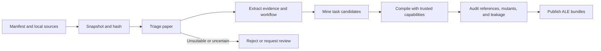

# Paper2ALE

Paper2ALE turns research papers and their pinned local artifacts into
paper-blind, self-contained, automatically verifiable ALE tasks. The paper is
used to construct the task, but the evaluated agent receives only the task
description, inputs, environment, and output contract.

Paper2ALE is a task compiler, not a paper-reproduction agent. Model output can
propose evidence, workflows, and protocols, but only reviewed compilers and
evaluators provide executable behavior.

## How the pipeline works



The pipeline starts from an explicit manifest and local source files. It does
not crawl the web or silently download code and data. Paper discovery and
ranking can be added upstream, while Paper2ALE owns the reproducible path from
resolved bytes to verified task packages.

Only a closed, bounded workflow with an independent verification route can be
published. Every release is content-addressed, visibility-partitioned, and
audited before packaging.

## Quick start

Python 3.11 or newer is required.

```powershell
python -m pip install -e .
```

Run the complete pipeline with the offline replay fixture. This requires no
LLM API:

```powershell
paper2ale orchestrate examples/orchestration/manifest.json `
  --replay examples/orchestration/replay.json
```

Compile and publish the included generic task:

```powershell
paper2ale audit examples/generic/project.json
paper2ale publish examples/generic/project.json --out dist --jobs 2
```

## Using your own paper

1. Create an orchestration manifest that names the paper, local code or data,
   provenance, licenses, and triage signals.
2. Resolve and hash the source assets.
3. Run orchestration with a structured provider adapter.
4. Review the generated project, then publish it through the trusted audit.

```powershell
paper2ale orchestrate manifests/my-paper.json `
  --command python `
  --command-arg provider_adapter.py `
  --asset-cache .paper2ale/assets
```

An LLM API is optional. Offline replays and manually authored projects need no
model. Automated extraction for a new paper needs a structured provider, which
may call either a local model or an operator-owned hosted API. Provider output
remains untrusted throughout the pipeline.

See [the orchestration guide](docs/ORCHESTRATION.md) for the manifest and
provider contracts.

## Which papers are accepted?

Paper2ALE uses a verification-first admission policy.

| Outcome | Typical reason |
| --- | --- |
| `eligible` | The workflow is reconstructable, bounded, self-contained, and independently verifiable. |
| `manual_review` | Provenance, licensing, evidence coverage, or a source conflict is uncertain. |
| `missing_artifacts` | Required bytes are unavailable and no sound analytic or synthetic construction exists. |
| `no_viable_task` or `rejected` | The paper is unreadable or unsuitable, resources are unbounded, or no reliable verifier can be built. |

Public code and data are useful but not absolute requirements. A paper may be
eligible without them when a trusted analytic oracle or synthetic generator
can produce an independently verifiable task. Scientific-quality judgments
remain explicit operator attestations; mechanically checkable asset and
license claims are reconciled against resolved snapshots.

## Controlling difficulty

Use `easy`, `medium`, `hard`, or `frontier` to change concrete task and
evaluation controls:

```powershell
paper2ale resolve-difficulty hard
paper2ale publish examples/hnn_hard/project.json `
  --difficulty hard --out dist --jobs 3
```

Difficulty separates the challenge presented to the agent, the strength of
hidden evaluation, and benchmark sampling coverage. A level is a structural
configuration, not proof that frontier agents will achieve a particular solve
rate. Empirical claims require trials bound to the exact task build and agent
system. See [the difficulty guide](docs/DIFFICULTY.md).

## Included examples

| Example | Purpose |
| --- | --- |
| [Offline orchestration](examples/orchestration/README.md) | Runs triage, extraction, workflow synthesis, compilation, and audit from a deterministic replay. |
| [Generic compiler](examples/generic/README.md) | Builds a hard affine-recovery task from an allowlisted declarative protocol. |
| [HNN smoke suite](examples/hnn/README.md) | Provides three fast, grounded Hamiltonian Neural Networks workflow tasks. |
| [Hard HNN suite](examples/hnn_hard/README.md) | Provides three structurally hard identification, variable-body, and coordinate-recovery tasks. |

## Trust and publication

- Source and asset bytes are pinned by hash with portable provenance records.
- Source text and provider output cannot register code, commands, or grading
  authority.
- Private graders recompute truth from evaluator-owned data; golden solutions
  must pass while realistic mutants must fail.
- Visibility, leakage, resource, reproducibility, path, checksum, and archive
  checks fail closed before release.

`build` may create a candidate build. `publish` requires full publication
readiness and emits deterministic agent, evaluator, author, and ALE-local
bundles.

## Scope and limitations

- Paper sourcing and internet-scale ranking are upstream concerns.
- The built-in generic compiler covers three safe data-transformation
  templates; new scientific workflows may require a reviewed capability or
  custom task family.
- Difficulty profiles have structural validation, but the hard examples have
  not yet been calibrated across a matrix of frontier models and agents.
- The repository produces ALE-compatible local bundles but does not claim a
  live `cua_bench`, cloud, or interactive computer-use run.

## Documentation

- [Architecture](docs/ARCHITECTURE.md): pipeline stages, trust zones, and identities.
- [Orchestration](docs/ORCHESTRATION.md): end-to-end manifests and providers.
- [Generation](docs/GENERATION.md): provider, replay, and project-generation contracts.
- [Difficulty](docs/DIFFICULTY.md): controls and empirical calibration.
- [Threat model](docs/THREAT_MODEL.md): publication gates and failure modes.
- [Extending Paper2ALE](docs/EXTENDING.md): providers, capabilities, and task families.
- [Changelog](CHANGELOG.md): version history.

## Development

```powershell
$env:PYTHONPATH = "src"
python -m unittest discover -s tests -v
```

The CI matrix runs on Windows and Ubuntu with Python 3.11 and 3.12.
