# Paper2ALE

Paper2ALE is a provenance-first pipeline for turning research papers and their
associated artifacts into paper-blind, specification-complete, executable ALE
task families. Its bounded PDF/text front end can call any structured model
adapter or an offline replay. Everything after the validated project handoff is
deterministic, seeded, visibility-partitioned, and content-addressed.

The repository contains two grounded *Hamiltonian Neural Networks* examples:
a fast three-task smoke suite and a separate hard suite with nonlinear,
compositional, and representation-recovery tasks. Both include private
instances, hidden graders, golden references, realistic mutants, manifests,
and deterministic agent, evaluator, author, and ALE-local bundles.

## Guarantees

- Exact source versions, licenses, citations, hashes, evidence IDs, workflow
  nodes, and source conflicts live in one strict project document.
- Model/source content is untrusted. A model can propose a project but never
  becomes a grading authority.
- Unresolved high-impact evidence conflicts block compilation.
- Difficulty levels resolve to concrete generator/evaluator controls. A family
  that ignores or misreports them fails preflight.
- Every stochastic instance derives from a master seed, task ID, instance ID,
  and purpose.
- Agent, evaluator, and author packages are projections of one immutable file
  inventory.
- Hidden graders recompute truth from evaluator-owned data and bounded
  participant artifacts.
- ZIP paths, types, case collisions, expanded sizes, checksums, executable
  modes, and visibility boundaries are verified before publication.
- Sorted entries, fixed timestamps, normalized modes, stable compression, and
  timing-free canonical QA make identical inputs produce identical archives.

See [THREAT_MODEL.md](docs/THREAT_MODEL.md) for the trust boundary and
publication assumptions.

## Quick start

Python 3.11 or newer is required. Installation includes NumPy and `pypdf`.

```powershell
python -m pip install -e .

paper2ale inspect examples/hnn/project.json
paper2ale audit examples/hnn/project.json
paper2ale build examples/hnn/project.json --out dist --jobs 3

paper2ale audit examples/hnn_hard/project.json --difficulty hard
paper2ale build examples/hnn_hard/project.json --difficulty hard --out dist --jobs 3
```

Without installing the package:

```powershell
$env:PYTHONPATH = "src"
python -m paper2ale audit examples/hnn_hard/project.json
```

Validate an emitted directory or archive independently:

```powershell
paper2ale validate dist/hnn-hard-grounded-suite/b-<build-prefix>
paper2ale validate dist/hnn-hard-grounded-suite/b-<build-prefix>/tasks/hnn-hard-variable-nbody/bundles/hnn-hard-variable-nbody.agent.zip
```

Re-running `build` resumes only after the catalog, directory manifest, archive
sizes, hashes, and ZIP structure validate. `--force` preserves an invalid
same-ID build under a quarantine name and creates a clean replacement.

## Generate from a paper

Create one strict source-metadata JSON object per local PDF/text file, then use
a command adapter for a hosted or local model:

```powershell
paper2ale generate .\paper.pdf `
  --metadata .\paper.source.json `
  --project-id my-paper-suite `
  --out .\projects\my-paper.json `
  --command python `
  --command-arg .\provider_adapter.py `
  --difficulty hard `
  --build `
  --build-out dist
```

The adapter reads a normalized request on stdin and returns a bounded JSON
envelope containing one complete project. Use `--replay replay.jsonl` instead
of `--command` for an API-free, reproducible run. Generation verifies source
hashes, bounds extraction, removes local paths from requests, flattens the
output schema, and requires exact provenance plus registered trusted families
before atomically publishing the project.

See [GENERATION.md](docs/GENERATION.md) for metadata, command-adapter, replay,
PDF, and one-command generation/build protocols. A new scientific domain still
needs a reviewed deterministic family plugin; model-generated evaluator code
is deliberately not auto-trusted. See [EXTENDING.md](docs/EXTENDING.md).

## Difficulty and calibration

The canonical choices are `easy`, `medium`, `hard`, and `frontier`. They
resolve through a versioned profile into concrete controls including instance
complexity/count, noise, masking, constraints, hidden/adversarial cases,
rollout horizon, pass fraction, and threshold scale. Custom profiles must be
bounded and monotone. Each aware family must emit an exact content-bound
consumption manifest.

```powershell
paper2ale build examples/hnn_hard/project.json --difficulty medium
paper2ale build examples/hnn_hard/project.json --difficulty hard
paper2ale build examples/hnn_hard/project.json --difficulty frontier
```

Calibrate measured agent trials with Wilson confidence intervals:

```powershell
paper2ale calibrate trials.json --project examples/hnn_hard/project.json
```

The report classifies each task/level group as calibrated, too easy, too hard,
inconclusive, or insufficiently sampled. Difficulty is relative to a pinned
model, agent harness, tools, budget, and repetition policy; labels alone are
not empirical calibration.

## HNN examples

The smoke suite in [examples/hnn/project.json](examples/hnn/project.json)
contains:

| Task | Participant artifact | Hidden evaluation |
| --- | --- | --- |
| Canonical gradient transform | `software/solution.py` | quadratic, batch, mutation, and shape tests |
| Scalar spring model | `output/<instance>/model.json` | derivative, rollout, energy, and safe-weight checks |
| Two-body equation audit | `output/<instance>/audit.json` | conflict, symbolic-power, direction, and numerical-force checks |

The hard suite in
[examples/hnn_hard/project.json](examples/hnn_hard/project.json) adds:

| Task | Main challenge | Hidden evaluation |
| --- | --- | --- |
| Coupled identification | recover a nonlinear three-DOF periodic Hamiltonian from noisy local labels | wide-angle fields and long rollouts |
| Variable-N gravity | solve softened dynamics across changing cardinality and close encounters | variable-body, numerical, and permutation cases |
| Canonical recovery | jointly recover mixed canonical coordinates and a coupled quartic energy | induced OOD fields and transformed rollouts |

Its reproducible publication-gate results and bundle hashes are recorded in
[examples/hnn_hard/BUILD_REPORT.md](examples/hnn_hard/BUILD_REPORT.md).

The source paper and official repository disagree on scientifically important
details. Both fixtures preserve those disagreements as explicit evidence and
pin a documented interpretation rather than silently blending sources.

## Pipeline

```mermaid
flowchart LR
    S["Pinned PDF, text, code, and data"] --> X["Bounded extraction"]
    X --> M["Structured model proposal or replay"]
    M --> V["Schema, lineage, conflict, family, and difficulty gates"]
    V --> F["Trusted deterministic family compiler"]
    F --> I["Seeded public and private instances"]
    I --> Q["Golden, mutant, leakage, resource, and reproducibility QA"]
    Q --> P["Agent, evaluator, author, and ALE-local projections"]
    P --> Z["Manifests and deterministic ZIPs"]
```



`paper2ale.project/v1` is the only deterministic compiler handoff. Schemas are
under [schemas](schemas):

- `project.schema.json` — pinned sources, profiles, and tasks;
- `evidence_graph.schema.json` — evidence, claims, conflicts, workflow nodes,
  and edges;
- `task_blueprint.schema.json` — disclosure, lineage, resources, artifacts,
  metrics, and hard gates;
- `difficulty_profile.schema.json` — levels, concrete controls, and target
  bands.

See [ARCHITECTURE.md](docs/ARCHITECTURE.md) for stage boundaries, identity,
resumable state, projections, and the ALE adapter.

## Build layout

```text
dist/<project-id>/b-<96-bit-build-prefix>/
  catalog.json
  project.lock.json
  MANIFEST.sha256
  tasks/<task-id>/
    task_build.json
    profiles/agent/
    profiles/evaluator/
    profiles/author/
    deploy/ale-local/
    bundles/*.zip
```

Catalogs and state retain the full 256-bit build ID. Only the physical build
directory uses a 96-bit prefix to keep canonical ALE variant paths below
legacy Windows limits. ALE-local operator bundles stage `input/` and
`software/` before the agent and withhold `reference/` until evaluation.

## Tests

```powershell
$env:PYTHONPATH = "src"
python -m unittest discover -s tests -v
```

Tests cover schemas and references, source ingestion, provider replay and
command adapters, difficulty resolution and calibration, path/visibility
safety, content storage and leases, deterministic archives, HNN golden
solutions, adversarial mutants, generated ALE hooks, and publication gates.
