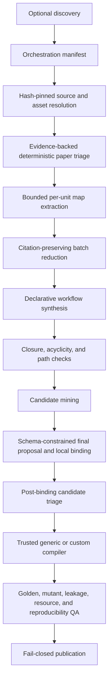

# Paper2ALE architecture

Paper2ALE treats a paper and associated artifacts as a hidden specification
for a task compiler. The target is a bounded, evidence-producing research
workflow, not necessarily every result or undocumented step in the paper.

The evaluated agent does not need the paper. It receives a self-contained task,
provided inputs, an output contract, and an environment. Paper identity,
construction evidence, hidden references, and trusted evaluators stay outside
the participant projection.

## Trust zones

The architecture has three zones.

1. **Operator and admission zone.** Optional discovery materializes local
   sources and writes an explicit manifest. Local resolvers hash the actual
   bytes. Public repository/dataset availability and their license metadata
   are checked against resolved asset snapshots. Scientific quality, evidence
   coverage, verification feasibility, conflicts, and resource signals remain
   explicit operator attestations consumed by deterministic policy.
2. **Untrusted extraction zone.** A completion provider maps source chunks,
   reduces evidence, proposes declarative workflows, and emits a final project
   proposal. Paper text, repository text, model output, and authority labels
   are untrusted data. No generated content is executed.
3. **Trusted compiler zone.** Strict validators bind citations and candidates
   to source hashes and registered capabilities. Fixed compiler code generates
   instances, references, graders, packages, and QA. Only this zone can create
   publication-ready evaluation.

An LLM can propose that an evaluator should compare a result with hidden
truth. It cannot provide the trusted executable comparator. That transition
requires an existing generic primitive or reviewed custom family code.

## Executable v0.3 data flow

The stages are:

1. `resolve_inputs`: ingest bounded PDF/text sources and snapshot local code,
   data, directories, and individual files. Hash raw bytes and strip local
   paths from portable data; record a path-free extraction lock for every
   source.
2. `triage_paper`: mechanically reconcile public code/data and known-license
   claims with resolved repository/dataset assets, then admit only deterministic
   policy decisions explicitly allowed by the manifest. Defaults admit only
   `eligible`.
3. `map_evidence`: bind each provider response to one evidence unit and derive
   finding IDs locally.
4. `reduce_evidence`: combine deterministic batches; facts may cite only
   finding IDs supplied to that batch.
5. `synthesize_workflows`: parse a strict declarative workflow IR. Commands,
   code, scripts, executors, unknown fields, unknown citations, and invalid
   artifact materialization origins are rejected.
6. `validate_workflow_closure`: require known artifacts, valid producer edges,
   acyclicity, declared outputs, and no external participant dependencies.
7. `mine_task_candidates`: derive bounded backward slices from participant
   outputs and identify independent evaluator plans.
8. `finalize_project`: constrain the final provider response to exact sources,
   source-extraction locks, asset locks, candidates, families/templates,
   project ID, and difficulty. The provider cannot author workflow bindings;
   local code persists the canonical selected workflow/candidate/family
   binding after validation.
9. `triage_task`: after family/protocol/binding/candidate semantic validation,
   require self-contained inputs, a machine-checkable output, bounded
   resources, evidence coverage, a trusted evaluator implementation, and an
   installed compiler capability.
10. `compile`: materialize only validated allowlisted protocols and persisted
    workflow bindings.
11. `audit`: require independent references, mutants, leakage checks, resource
    smoke checks, reproducibility, and valid packages.
12. `publish`: in CLI release mode, a trusted audit callback must report
    publication readiness before the project is atomically committed; the CLI
    then runs fail-closed `publish_project` packaging to `--build-out` and
    prints a combined orchestration/build envelope.

All completion calls have stable request IDs and bounded structured responses.
`ReplayProvider` can reproduce the extraction zone offline. `CommandProvider`
can invoke either a local model or an operator-owned API adapter; Paper2ALE has
no mandatory vendor API.

## Core interchange objects

### Asset snapshot

`paper2ale.asset-snapshot/v1` records an asset ID and kind, a file-tree digest,
total bytes, strict metadata, and a sorted file list. Each file records only a
safe relative path, size, SHA-256, media type, extraction status, and extractor
identity. Text is evidence input but is not copied into the portable lock.

Raw asset bytes remain in an operator-selected content-addressed `AssetCache`.
`BuildContext` exposes only snapshot-declared `(asset_id, relative_path)` reads
to trusted families and rechecks size and SHA-256. Cache location is operational
state: it does not enter project or build identity.

### Source extraction lock

`paper2ale.source-extraction/v1` binds one source's raw SHA-256, media type,
size, extractor identity, and sorted extracted chunks. Each chunk records its
locator, text SHA-256, and character count; an aggregate extraction digest
binds the complete normalized extraction. These path-free locks enter final
project-synthesis context and the orchestration receipt. Identical extracted
units can retain map request IDs across extractor changes, while the final
context still records the exact extractor and extraction lock.

### Suitability report

`paper2ale.suitability/v1` records the subject, decision, score, hard failures,
review flags, warnings, and normalized input signals. Hard failures are not
overridden by a soft score.

### Workflow IR

`paper2ale.workflow/v2` contains artifact nodes, operation nodes, declared
outputs, and evidence IDs. Every artifact has an explicit materialization
`origin`:

- `asset` requires a safe exact `asset_ref` on a provided/hidden input or
  reference and must match cited asset evidence;
- `trusted_generator` requires an advertised `capability_ref`;
- `participant` and `trusted_evaluator` require generated artifacts and
  producers with matching operation authority;
- `external` is explicit and cannot close a participant task dependency.

Operations select an allowlisted semantic type and descriptive authority
(`participant`, `constructor`, or `trusted_evaluator`). Neither an origin nor
an authority label grants executable permission.

### Task candidate

A mined candidate records its workflow and target artifact, backward operation
slice, required inputs, output, verifier plan, evidence IDs, and
self-contained/verification readiness. It is still a proposal.

### Workflow binding

`paper2ale.workflow-binding/v1` persists the exact closed workflow, the
canonical candidate re-mined from that workflow, and the selected family. Its
`binding_<sha256>` covers all three. The final provider is forbidden to emit
this object; orchestration constructs it locally and the task-family candidate
validator rechecks protocol, operation, origin, capability, and target
alignment before compilation. Generic project tasks require this binding.

### Canonical project

`paper2ale.project/v1` is the deterministic compiler handoff. It contains:

- an exact source bundle and optional asset snapshots;
- evidence records, claims, conflicts, workflow nodes, and selected
  interpretations;
- task blueprints with disclosure mode, lineage, resources, output contract,
  metrics, hard gates, and instance policy;
- a validated family/template protocol for declarative generic tasks;
- a canonical workflow binding for every candidate-compiled task;
- an optional versioned difficulty selection.

The disclosure modes remain distinct:

- `specification_preserving`: the method is specified while source identity
  and irrelevant narrative are removed;
- `masked_workflow_completion`: a supplied workflow has meaningful missing or
  faulty stages;
- `method_masked_rediscovery`: the outcome is graded while the originating
  method remains hidden.

Unresolved high-impact source conflicts cannot support a task. A task proceeds
only after its protocol cites a recorded interpretation.

## Trusted generic compiler

The `generic` family reduces the need for paper-specific plugins. It is a
fixed protocol virtual machine with three current templates:

- numeric affine inference;
- typed-table filter/sort/project;
- grouped JSON aggregation.

The protocol can select only registered instance generators, reference
solvers, output primitives, metrics, and gates. It is bounded strict JSON. It
cannot add a command, import, code body, path, arbitrary metric, or new
executable. Fixed module-owned bytes implement the participant runner, grader,
ALE adapter, and reference/mutant preparation.

Fixed authored families use a separate project/task validator that binds their
exact reviewed source bundle, evidence graph, and task semantic contract.
Matching only a family or task ID is insufficient to activate authored
executable semantics.

This is general within its capability catalog, not universal. A task outside
the catalog remains `manual_review` until reviewed code extends the generic
primitive set or registers a custom task family.

The generic v1 catalog is synthetic/inline-JSON only. It deliberately rejects
workflow artifacts with `asset_ref` because no reviewed raw-asset materializer
is shipped yet. Snapshotted code and data remain evidence/provenance unless a
custom family explicitly and safely maps their bytes into public or evaluator
partitions.

Difficulty controls are declared per template. Numeric affine consumes
instance/complexity/masking/constraint controls plus numeric hidden-case,
threshold, rollout-horizon, and adversarial controls; noise and
required-pass-fraction are conditional on the protocol. Table and grouped-JSON
templates consume
instance/complexity/constraint and hidden/adversarial controls. A non-default
override for a control outside the selected template's semantic set is a hard
error. These monotone structural effects are not an empirical model solve-rate
claim.

## Difficulty and randomization

Difficulty v2 separates:

- per-episode `challenge`;
- hidden `evaluation_power`;
- `benchmark_sampling`.

Semantic and sampling identities are separate. Sampling-only changes preserve
abstract difficulty semantics; challenge/evaluation changes do not. Persisted
calibration additionally binds that semantic identity to the exact task and
`task_build_id`, so different compiled builds are never pooled. Trials also
carry a complete pinned agent-system ID and never pool model revisions,
harnesses, tools, budgets, or network policies.

A v2 report is release-usable only when `verified_claim_ready` is true: the
statistical and monotonicity targets pass and the exact catalog/project-lock
pair verifies. No-catalog reports are exploratory, have unverified task-build
provenance, and cannot return CLI success.

Random seeds are purpose-separated for public instances, hidden evaluation,
and mutations. A builder must consume the resolved controls and emit a
content-bound manifest proving what it used.

## Identity and resumability

Semantic identities use SHA-256 over canonical JSON:

- source files and asset blobs use raw-byte hashes;
- asset trees hash sorted relative paths, sizes, and raw-byte hashes;
- provider request IDs cover prompts, bound inputs, schema, and parameters;
- difficulty `semantic_id`, `sampling_id`, and `resolution_id` cover their
  distinct purposes;
- `build_id` covers the resolved project, compiler/verification identities,
  seed, difficulty, and instance overrides;
- the compiler registry records each family `compiler_id`, capabilities, and
  implementation hashes for its builder, protocol validator/schema factory,
  candidate validator, and project/task validator;
- the verification registry records implementation hashes for publication
  runtime functions and every registered golden/mutant preparation hook;
- `task_build_id` covers the raw family inventory, visibility, executable
  modes, and verification plan;
- `task_calibration_<digest>` binds the sampling-independent difficulty
  semantics, task ID, and exact `task_build_id` for persisted trials;
- content-store objects use their byte digest directly.

Operational timestamps and wall-clock measurements do not enter canonical
QA. ZIP entries are sorted with fixed timestamps, normalized permissions, and
stable compression. Reproducibility QA rebuilds inventories and projected
archives and compares hashes. It also executes every golden and mutant grader
twice and compares stdout, stderr, process state, and parsed JSON payload; a
nondeterministic runtime result blocks publication.

`StageStateStore` uses SQLite WAL mode and expiring leases for deterministic
worker recovery. Reuse occurs only after catalogs, manifests, hashes, archive
structure, and build identity validate. Forced replacement quarantines an
invalid same-ID build.

## Visibility projections

Every generated file has one base visibility:

| Visibility | Contents |
| --- | --- |
| agent | task description/card, participant inputs, starter software, ALE module |
| evaluator | hidden references, trusted grader, successful example |
| author | evidence, provenance, protocols, QA, calibration, notes |

Profiles are monotonic projections: agent; agent plus evaluator; or all three.
No task directory is maintained separately. One immutable `BuildFile`
inventory creates directory projections, manifests, ZIPs, compatibility
archives, and the ALE-local operator bundle.

The ALE-local layout stages `input/` and `software/` before the agent, then
withholds `reference/` until evaluation. `DEPLOYMENT.json` records the
source-to-destination map.

## Discovery and execution scope

Paper discovery and ranking may run upstream, but its only trusted handoff is
the explicit orchestration manifest. Network retrieval, license decisions, and
paper-quality attestations remain operator responsibilities.

v0.3 emits and validates ALE-compatible local packages. It does not run
`cua_bench`, interactive computer-use episodes, live cloud jobs, or production
deployment. Publication readiness refers to the deterministic task-generation
and package gates described here.
